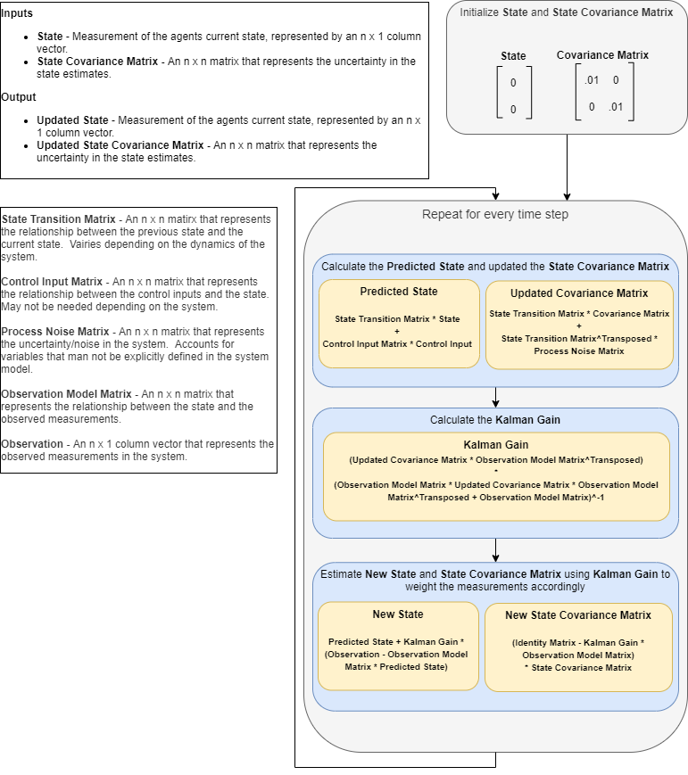

### Kalman Filter Overview

The Kalman Filter is an estimation algorithm used to blend a prediction of the system state with the actual observation/measurements of the system state.  It does this by calculating the **Kalman Gain**, which is used to weight the confidence of the observed state vs the predicted state depending on external factors such as noise.  The flow of the algorithm is detailed as follows.

