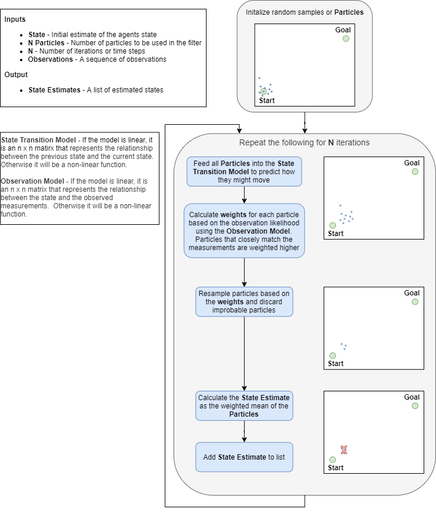

### Particle Filter Overview

The Particle Filter is an estimation algorithm used to estimate the system state in non-linear and non-Gaussian spaces.  It does this by calculating the mean of the most likely guesses of an observed state. The flow of the algorithm is detailed as follows.

