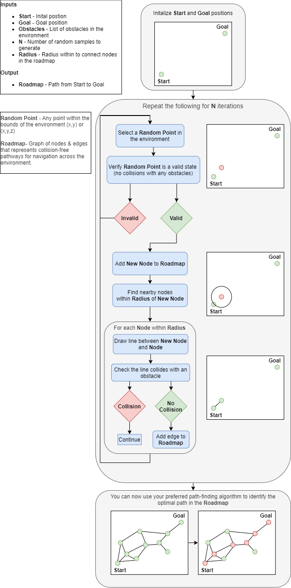

###Probabilistic Roadmap (PRM) Algorithm Overview

PRM is a path planning algorithm that generates a roadmap within an environment.  It does this by iteratively adding nodes & edges to a graph structure as it randomly explores the environment.  The roadmap represents collision-free pathways an agent can use to navigate the environment.  The flow of the algorithm is detailed below.

