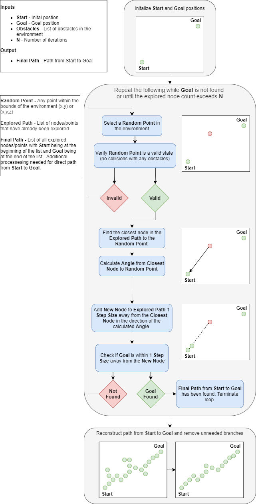

### Rapidly-exploring Random Tree (RRT) Algorithm Overview

RRT is a path planning algorithm that attempts to find a reasonable path from an inital state to a goal state within an environment.  It does this by iteratively building a tree structure as it randomly explores the environment.  The flow of the algorithm is detailed below.

